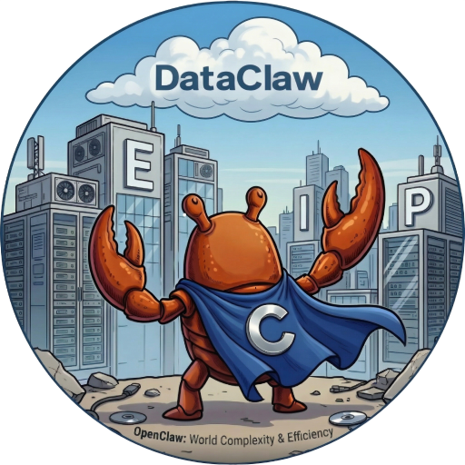

<div align="center">

<h1>DataClaw</h1>



<br/>
<br/>

[](https://gtmllab.github.io/DataClaw/)
[](https://huggingface.co/datasets/GTMLLab/DataClaw)


</div>

> A data-analysis benchmark for OpenClaw-style end-to-end agents. Every task is grounded in real-world data and has a single objective gold answer.


[简体中文](README.zh-CN.md)

## 🌊 Data Analysis Tasks Are Changing in the OpenClaw Era

With the emergence of end-to-end agents like OpenClaw, data analysis is no longer equivalent to static QA — "read a passage, output one answer." Real-world data analysis tasks often require agents to locate evidence across heterogeneous files, filter and join entities across tables, perform statistical and normalization calculations, verify intermediate results, and strictly follow output constraints.

This means the core difficulty of a benchmark has shifted from answer generation alone to full agent-driven execution. A truly valuable data-analysis benchmark must test not only whether the final answer is correct, but also whether the agent can reliably complete a series of steps — retrieval, filtering, computation, verification, and constraint compliance — in complex data environments.

DataClaw is designed for exactly this shift. It evaluates not abstract capability divorced from execution, but how OpenClaw-style end-to-end agents actually perform on data analysis tasks under real data conditions, explicit task constraints, and a reproducible execution protocol.

## 🔍 What Is DataClaw?

DataClaw is a process-oriented data-analysis benchmark for realistic, complex data environments. Its core goal is not merely to measure agents' end-task performance, but to serve as a high-fidelity testbed that also evaluates, at fine granularity, how agents evolve when facing real-world complexity and multi-step reasoning.

DataClaw simulates at scale the noisy, weakly-semantic, cross-domain data environments found in the real world. Complex data-analysis questions are authored by domain experts in finance and computer science, and each task's process annotations and unique objective answers are cross-verified by human experts with AI assistance. Process annotations include task milestones, human-corrected reference trajectories, and evidence data sources. DataClaw adopts OpenClaw as its unified agent framework.


## 🎯 Why DataClaw?

- **From idealized data environments to imperfect real-world data environments.** DataClaw contains a mix of structured and unstructured data, covering enterprise profiles, business operating status, regional industry statistics, national industry statistics, and policy texts. All data is collected from the real world and comes with friction such as missing indicators, inconsistent definitions, and inconsistent naming. Tasks face realistic data environments, not over-cleaned single-table lookups.
- **From single-shot static queries to multi-step dynamic reasoning.** DataClaw tasks typically require agents to complete a multi-stage chain of operations rather than producing a one-shot answer. The challenge for agents comes not only from retrieval but also from cross-source integration, metric construction, aggregation computation, and format constraint compliance.
- **From outcome-oriented evaluation to process-oriented evaluation.** DataClaw goes beyond simple outcome-accuracy evaluation and dissects how the agent's execution unfolds at fine granularity. Outcome-oriented evaluation paradigms focus only on final accuracy. This black-box approach ignores intermediate reasoning and provides little actionable signal for guiding optimization.

## 🏗️ Repository Layout


Key directories and scripts:

- `assets/database/`: Benchmark data files, injected wholesale into the container workspace at run time. The root contains `internal_metrics.csv` (internal business-logic knowledge base); `enterprise/`, `industry/`, and `policy/` hold the three theme-domain datasets.
- `assets/qa_raw/`: Raw task source files.
- `assets/qa_gold/`: Minimized gold files derived from `qa_raw`.
- `tasks/`: Generated OpenClaw task spec files.
- `dataclaw/build_tasks.py`: Builder that produces `qa_gold` and `tasks/` from `qa_raw`.
- `dataclaw/eval/run_batch.py`: Host-side evaluation orchestrator; one isolated container per task.
- `dataclaw/utils/docker_utils.py`: Container lifecycle management, OpenClaw onboarding, and model configuration.
- `dataclaw/utils/grading.py`: Outcome scoring (LLM-judged Acc).
- `dataclaw/utils/process_grading.py`: Process scoring (EE on correct tasks; GPR / TPE on incorrect tasks).
- `script/docker_save_image.sh`: Image build and export script.

### ⚙️ Evaluation Lifecycle

Each evaluation task runs in its own Docker container. The host orchestrator manages the full lifecycle:

```text
Host (dataclaw/eval/run_batch.py)
  |
  +-- For each task (parallel via --parallel N):
      1. docker run   -> start isolated container
      2. docker cp    -> inject workspace files
      3. docker exec  -> OpenClaw onboard
      4. docker exec  -> start gateway (background)
      5. docker exec  -> set model and run agent
      6. docker exec  -> run llm_judge scoring
      7. docker cp    -> collect logs and results
      8. docker rm    -> remove container
```


## 🚀 User Quick Start

### 1. Obtain the Pre-built Image

Download the pre-built image archive from Releases and load it:

```bash
docker load -i <dataclaw-image-archive>.tar
```

After loading, confirm the local image tag matches `DOCKER_IMAGE` in `.env`.

### 2. Clone This Repository

```bash
git clone <repository-url>
cd <repository-dir>
```

Use the actual repository URL shown on the GitHub page.

### 3. Install Python Dependencies

```bash
pip install pyyaml python-dotenv
```

> `pyproject.toml` requires Python `>=3.10`. For a fuller local dev setup, install additional dev dependencies as you prefer.

### 4. Configure Environment

Copy the template:

```bash
cp .env.example .env
```

Edit `.env` and pay attention to at least the following fields:

| Variable | Required | Description |
| --- | --- | --- |
| `DEFAULT_MODEL` | Yes | Model under test, e.g. `openrouter/anthropic/claude-sonnet-4.6` |
| `OPENROUTER_API_KEY` | One of two | Used when the main model or judge is called via OpenRouter |
| `OPENCLAW_CUSTOM_BASE_URL` + `OPENCLAW_CUSTOM_API_KEY` | One of two | Custom OpenAI-compatible API |
| `OPENCLAW_CUSTOM_MODEL_ID` | No | Explicit model id at the custom provider for the main model |
| `JUDGE_MODEL` | No | Judge model; default in `.env.example` |
| `JUDGE_CUSTOM_BASE_URL` + `JUDGE_CUSTOM_API_KEY` | No | Separate custom endpoint for the judge |
| `JUDGE_CUSTOM_MODEL_ID` | No | Explicit model id for the judge custom endpoint |
| `DOCKER_IMAGE` | No | Local image tag; must match the loaded image |

#### 🔌 Custom OpenAI-compatible API

If you do not use OpenRouter, set in `.env`:

```bash
OPENCLAW_CUSTOM_BASE_URL=https://your-api-url/v1
OPENCLAW_CUSTOM_API_KEY=your_api_key
OPENCLAW_CUSTOM_MODEL_ID=your-provider/your-model
DEFAULT_MODEL=your-provider/your-model
```

If the API runs on the host:

```bash
OPENCLAW_CUSTOM_BASE_URL=http://host.docker.internal:8000/v1
```

When the judge uses a separate endpoint:

```bash
JUDGE_CUSTOM_BASE_URL=https://your-judge-api-url/v1
JUDGE_CUSTOM_API_KEY=your_judge_api_key
JUDGE_CUSTOM_MODEL_ID=your-provider/your-judge-model
```

##### Common Auth Setups (Main Model vs Judge)

| Scenario | Main model | Judge | Required config |
| --- | --- | --- | --- |
| A | Custom API | OpenRouter | `OPENCLAW_CUSTOM_*` + `OPENROUTER_API_KEY` |
| B | OpenRouter | OpenRouter | `OPENROUTER_API_KEY` |
| C | Custom API | Custom API (separate endpoint) | `OPENCLAW_CUSTOM_*` + `JUDGE_CUSTOM_*` |

### 5. Run Evaluation

```bash
# Run all tasks
python dataclaw/eval/run_batch.py --model openrouter/anthropic/claude-sonnet-4.6

# Run selected tasks
python dataclaw/eval/run_batch.py --model ... --suite task_001,task_002

# Run in parallel
python dataclaw/eval/run_batch.py --model ... --parallel 4

# Run a single task file
python dataclaw/eval/run_batch.py --task tasks/task_001_xxx.md

# Or use the convenience script (reads DEFAULT_MODEL from .env)
bash script/run.sh
```

### CLI Options

| Flag | Default | Description |
| --- | --- | --- |
| `--model` / `-m` | `DEFAULT_MODEL` in `.env` | Model under test |
| `--judge` | `JUDGE_MODEL` in `.env` | Judge model |
| `--suite` / `-s` | `all` | `"all"` or comma-separated task IDs |
| `--task` / `-t` | — | Path to a single `task.md` |
| `--parallel` / `-p` | `1` | Parallel container count |
| `--timeout-multiplier` | `1.0` | Scale all task timeouts |
| `--runs` | `1` | Repeat runs per task |
| `--resume` | — | Resume from last interrupted run |
| `--verbose` / `-v` | — | Enable verbose logging |

### 6. Results

After a run completes, results are saved under `output/<task_id>/<model_timestamp_runid>/`:

```text
output/<task_id>/<suffix>/
├── score.json               # outcome score (Acc)
├── process_score.json       # process scores (EE / GPR / TPE)
├── usage.json               # token usage, cost, elapsed time
├── agent.log                # agent execution log
├── gateway.log              # gateway log
├── chat.jsonl               # full conversation record
├── judge_chat.jsonl         # outcome-judge conversation
└── judge_process_chat.jsonl # process-judge conversation
```

A global summary is written to:

```text
output/summary_<model>.json
```

### 7. Grading Rules

DataClaw scores each run along **four metrics**.

| Metric | Definition | Scope | Direction |
| --- | --- | --- | --- |
| **Acc** | LLM-judge semantic match between predicted answer â and gold answer a; multi-subquestion tasks return the normalized mean over the L sub-answers. | All tasks | ↑ |
| **EE** | Execution Efficiency = N / T, where N is the gold reference step count and T is the agent's actual step count. EE > 1 means the agent solved it in fewer steps than the gold trajectory. | Correct tasks only | ↑ |
| **GPR** | Goal Progress Rate = (1/M) Σⱼ 𝕀(mⱼ achieved); fraction of M annotated milestones the agent reaches anywhere in its trajectory. Captures partial process credit when the final answer is wrong. | Incorrect tasks only | ↑ |
| **TPE** | Temporal Progress Efficiency = (Σⱼ 𝕀(mⱼ) · γ^max(tⱼ − N, 0)) / Σⱼ 𝕀(mⱼ), γ = 0.9; averages an exponential temporal-decay factor over the milestones the agent did achieve. Milestones reached by step N contribute 1; later ones decay. TPE = 1 means all achieved milestones were on time, lower values indicate later concentration. Range [0, 1]. | Incorrect tasks only | ↑ |

### 8. Resume After Interruption

Long batch evaluations may be interrupted unexpectedly. The evaluation framework automatically saves a progress file after each task completes:

```text
output/progress_<model>.json
```

Simply append `--resume` to the original command to resume:

```bash
# Original run (interrupted midway)
python dataclaw/eval/run_batch.py --model openrouter/anthropic/claude-sonnet-4.6 --suite all

# Resume (keep other arguments the same)
python dataclaw/eval/run_batch.py --model openrouter/anthropic/claude-sonnet-4.6 --suite all --resume
```

On resume, the framework automatically verifies that `--model`, `--suite`, and `--runs` match the previous run; if they don't, it exits with an error. Once all tasks are completed, the progress file is removed automatically.

To discard previous progress and start fresh, simply delete the progress file:

```bash
rm output/progress_<model>.json
```

### 9. Cleanup

Interrupted runs may leave behind uncleaned containers. Clean them up as follows:

```bash
IMAGE=<your-docker-image-tag>
docker ps -a --filter "ancestor=${IMAGE}" -q | xargs -r docker rm -f
```

Preview containers that would be removed:

```bash
IMAGE=<your-docker-image-tag>
docker ps -a --filter "ancestor=${IMAGE}" --format "{{.Names}}\t{{.Status}}"
```

## 📊 Dataset Statistics

DataClaw's data does not come from synthetic samples or teaching examples; it is built on the publishing team's long-term, front-line data accumulation and industry insights from research on Chinese enterprises, industries, and policies. The current version is mainly based on data from 2022. After necessary de-identification, tasks are constructed to avoid model knowledge leakage as much as possible while preserving the information noise and data friction found in real business settings. Task authoring and annotation are conducted by a professional team from Lingnan College, Sun Yat-sen University, balancing academic rigor and practical usability.

### 🗂️ Data Environment Statistics

Under a theme-domain view and business-oriented taxonomy, the current data environment is organized into **3 theme domains**: **Enterprise**, **Industry**, and **Policy**; subcategories cover enterprise profiles and regional profiles, enterprise core competitiveness, business operating status, regional/national industry statistics, policy releases, and full policy texts — closely aligned with real research and consulting workflows. The 3 theme domains contain **17 independent data sources** (each data file counts as one source, all mounted under `assets/database/`): **17** are placed under theme subdirectories `enterprise/`, `industry/`, `policy/`; in addition, **1** root-level file, `internal_metrics.csv`, serves as an **internal business-logic knowledge base** and does not belong to any theme domain. Details below.

| Dimension | Value | Notes |
| --- | --- | --- |
| Theme domains | 3 | Enterprise, Industry, Policy |
| Secondary themes | 7 | Enterprise ×3 (profiles, core competitiveness, business status), Industry ×2 (regional industry, national industry), Policy ×2 (release status, full text) |
| Total data sources | 17 | Injected into the container workspace at run time |
| Format | CSV | Primarily CSV; includes both structured fields and unstructured long-text content |
| Time span | Mainly concentrated in 2022 | Statistical periods vary across sources |

**The 17 data sources by theme domain and secondary theme**

<table>
<thead>
<tr><th>Theme domain</th><th>Secondary theme</th><th align="right">Sources</th><th>Files</th></tr>
</thead>
<tbody>
<tr>
<td style="white-space:nowrap">Enterprise</td>
<td style="white-space:nowrap">Enterprise profiles</td>
<td align="right">5</td>
<td><code>enterprise/company_profile.csv</code><br><code>enterprise/company_profile_as.csv</code><br><code>enterprise/company_profile_eu.csv</code><br><code>enterprise/company_profile_na.csv</code><br><code>enterprise/company_profile_oc.csv</code></td>
</tr>
<tr>
<td style="white-space:nowrap">Enterprise</td>
<td style="white-space:nowrap">Core competitiveness</td>
<td align="right">1</td>
<td><code>enterprise/company_core.csv</code></td>
</tr>
<tr>
<td style="white-space:nowrap">Enterprise</td>
<td style="white-space:nowrap">Business status</td>
<td align="right">3</td>
<td><code>enterprise/company_operation_status.csv</code><br><code>enterprise/company_operation_status_detail.csv</code><br><code>enterprise/company_operation_yearly_status.csv</code></td>
</tr>
<tr>
<td style="white-space:nowrap">Industry</td>
<td style="white-space:nowrap">Regional industry</td>
<td align="right">3</td>
<td><code>industry/regional_industry_status.csv</code><br><code>industry/regional_industry_status_detail.csv</code><br><code>industry/regional_industry_yearly_status.csv</code></td>
</tr>
<tr>
<td style="white-space:nowrap">Industry</td>
<td style="white-space:nowrap">National industry</td>
<td align="right">3</td>
<td><code>industry/national_industry_status.csv</code><br><code>industry/national_industry_status_detail.csv</code><br><code>industry/national_industry_yearly_status.csv</code></td>
</tr>
<tr>
<td style="white-space:nowrap">Policy</td>
<td style="white-space:nowrap">Policy release status</td>
<td align="right">1</td>
<td><code>policy/policy_release_status.csv</code></td>
</tr>
<tr>
<td style="white-space:nowrap">Policy</td>
<td style="white-space:nowrap">Full policy text</td>
<td align="right">1</td>
<td><code>policy/policy_resource.csv</code></td>
</tr>
</tbody>
</table>

> At execution time, agents typically need to align entities across files, join across tables, normalize definitions, and perform aggregation calculations, rather than simply looking up values in a single file; when needed, they must also consult business conventions in `internal_metrics.csv`. This is the core value of DataClaw for evaluating real-scenario data understanding and reasoning capabilities.

### 📋 Task Statistics

The current version contains **492** tasks across **7** categories, with an overall difficulty distribution of **131 easy / 286 medium / 75 hard**.

| Category code | Meaning | Count | Difficulty split |
| --- | --- | --- | --- |
| `enterprise_industry_analysis` | Enterprise–industry analysis | 226 | easy 115 / medium 111 |
| `enterprise_industry_policy_analysis` | Enterprise–industry–policy linkage analysis | 76 | easy 10 / medium 66 |
| `comprehensive_decision` | Comprehensive decision | 70 | easy 6 / medium 45 / hard 19 |
| `international_comparison` | International comparison | 39 | medium 25 / hard 14 |
| `hypothesis_verification` | Hypothesis verification | 29 | medium 14 / hard 15 |
| `industry_planning` | Industry planning | 28 | medium 14 / hard 14 |
| `risk_assessment` | Risk assessment | 24 | medium 11 / hard 13 |

> Except for the 39 `international_comparison` tasks, all others are explicitly restricted in the current task spec to use only `./database/`, with no web search.

## 🙏 Acknowledgements

DataClaw is jointly released by Prof. Chuan Chen's team at the School of Computer Science, Sun Yat-sen University, and the Southern Weekly Sci-Tech Power Research Center. We sincerely thank the Southern Weekly Sci-Tech Power Research Center for providing invaluable data and tremendous support.

This project also builds on excellent open-source agent ecosystems. We gratefully acknowledge:

 [WildClawBench](https://github.com/InternLM/WildClawBench)

 [Claw-Eval](https://github.com/claw-eval/claw-eval)

 [PinchBench](https://github.com/pinchbench/skill)
